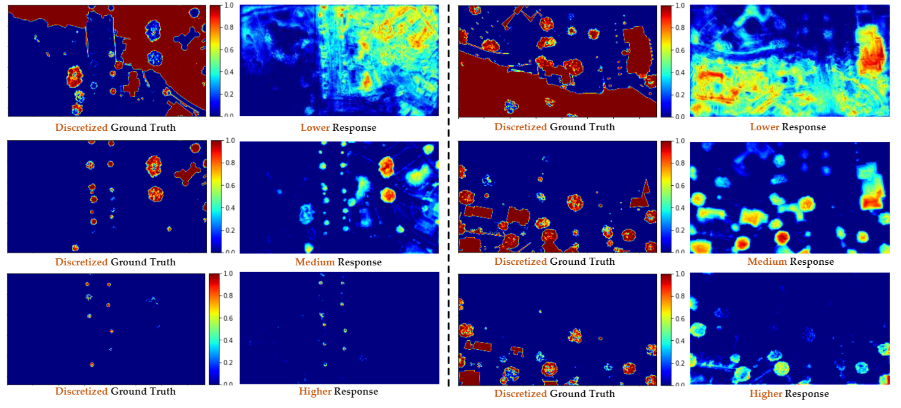

# DLT-Height-Estimation.pytorch

    

GeoAI is a library based on PyTorch, that provides datasets, model implementations and benchmark results for Remote Sensing data.

This library is inspired by TorchGeo and MMDetection. The main targets of this library include:

for machine learning experts to use geospatial data in their workflows, and
for remote sensing experts to use their data in machine learning workflows.

  

GeoAI is a library based on PyTorch, that provides datasets, model implementations and benchmark results for Remote Sensing data.

This library is inspired by TorchGeo and MMDetection. The main targets of this library include:

for machine learning experts to use geospatial data in their workflows, and
for remote sensing experts to use their data in machine learning workflows.

## Introduction

## License

This project is released under the [Apache 2.0 license](LICENSE).
